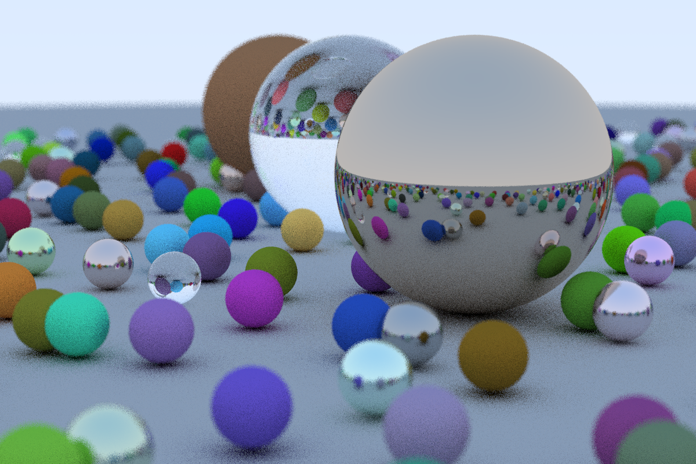

# Ray-tracing-in-one-weekend-CSharp

A C# port of Peter Shirley's [Ray Tracing in One
Weekend](https://www.amazon.com/gp/product/B01B5AODD8/ref=as_li_tl?ie=UTF8&camp=1789&creative=9325&creativeASIN=B01B5AODD8&linkCode=as2&tag=inonwe09-20&linkId=OPNJXXJY2IBCMEGE) ([book, version 1.55](https://drive.google.com/drive/folders/14yayBb9XiL16lmuhbYhhvea8mKUUK77W)
and [C++ code](https://github.com/RayTracing/raytracinginoneweekend) available for free).

Running the application generates a random scene:

If you feel a bit rusty on the math, you may want to start with a few posts I
wrote while working through the book:

- [Ray tracing: Computing ray-circle intersections](http://bugfree.dk/blog/2018/09/01/ray-tracing-computing-ray-circle-intersections)
- [Ray tracing: Computing ray-sphere intersections](http://bugfree.dk/blog/2018/09/03/ray-tracing-computing-ray-sphere-intersections)

## Getting started

    $ git clone https://github.com/ronnieholm/Ray-tracing-in-one-weekend-CSharp.git
    $ cd Ray-tracing-in-one-weekend-CSharp.git
    $ dotnet run -c release > out.ppm
    $ display out.ppm

On my Intel Core i7-7560U CPU @ 2.40GHz laptop running Linux and .NET Core 3,
ray tracing takes about two minutes.

## Benchmarking

For benchmarking, writing to standard output should be disabled in
``Program.cs``:

### .NET 5 (Linux)

    real    1m38,357s
    user    1m38,768s
    sys     0m0,243s

### Peter Shirley's C++ version:

    % git clone https://github.com/RayTracing/raytracinginoneweekend.git
    % cd raytracinginoneweekend/src/

Comment out the last ``std::cout`` statement in ``main.cc``.

    % g++ -O2 main.cc 
    % time ./a.out > /dev/null 

    real    1m13.045s
    user    1m12.789s
    sys     0m0.056s

In terms of raw computation power, .NET doesn't come close to C++. At least
not while staying true to the C++ code structure.

## See also

- Live coding implementation in C++ ([part 1](https://www.youtube.com/watch?v=VXF4xzZIvfw), [part 2](https://www.youtube.com/watch?v=Pc1TbuX2NHk), [part 3](https://www.youtube.com/watch?v=tQOK696mBfU), [part 4](https://www.youtube.com/watch?v=1N2afgppQvw)). Adds commentary
  and derives equations that the books glosses over.